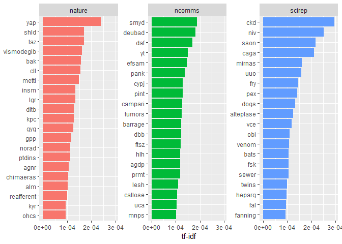

Can I publish this in Nature? An NLP approach
================
2018-11-06

Scraping article text
=====================

To start, we're going to need some article text to mine. I'm going to keep this within the Nature ecosystem, as A) the url syntax and webpage structures are fairly consistent (to facilitate scraping), and B) the one button submit-my-manuscript-rejected-from-Nature-to-NatComms feature pretty well crystallizes throwing oneself down the impact staircase when shopping for journals. I'm going to use the `Rcrawler` package to find and scrape the text from recent issues of Nature, Nature Communications, and Scientific Reports (about 250 articles from each journal to start with), clean up the text a bit, and store it in a dataframe for further analysis. I'm choosing these specific journals as they represent three levels of the impact hierarchy while still publishing across (ostensibly) all fields - we can then account for things like field bias in whether or not something is deemed worthy of a Nature byline.

Note that this particular workflow is due to the way `Rcrawler` generates output - it saves the pages crawled to the `INDEX` dataframe, and the scraped contents as a nested list called `DATA`. Each loop iteration below should find ~50 articles (visit the urls to see the page structure), and will extract the article text and do some light cleaning before appending it to the final dataframe. It takes a while to run (less than an hour on my laptop, but still, fair warning).

``` r
library(Rcrawler)
library(tidyverse)
```

``` r
# supplying urls to TOC is waaaaaay more efficient than crawling (links out vs. articles ~ 200:1)
nature.urls <- paste0("https://www.nature.com/nature/articles?searchType=journalSearch&sort=PubDate&type=letter&page=",
                      seq(5))
ncomms.urls <- paste0("https://www.nature.com/ncomms/articles?searchType=journalSearch&sort=PubDate&type=article&page=",
                      seq(5))
scirep.urls <- paste0("https://www.nature.com/srep/articles?searchType=journalSearch&sort=PubDate&type=article&page=",
                      seq(5))
urls <- c(nature.urls, ncomms.urls, scirep.urls)
journals <- rep(c("nature", "ncomms", "scirep"), each = 5)

# define empty data frame to collect output
nature.data <- data_frame(
  journal = character(),
  url = character(),
  article = character()
)

# crawl pages and extract article content
for(i in 1:length(urls)){
  Rcrawler(urls[i],  # page to scrape
           no_cores = 4, no_conn = 4, # number of workers and connections to open
           MaxDepth = 1, # only pursue links within given url (not links within linked pages, etc.)
           DIR = "E:/Learning_NLP/crawling_nature/pages", # where to save html and content files
           RequestsDelay = 1, # time between requests in seconds (don't get banned) 
           Obeyrobots = FALSE, # necessary for nature, apparently they don't like crawlers...
           urlregexfilter = "articles/s[0-9]+-[0-9]+-[0-9]+", # only save research articles (no news, corrections, etc.)
           ExtractXpathPat = "//p", ManyPerPattern = TRUE) # only extract para info; 
              # this will include article content sections as well as references and some other noise

  # filter content chunks by size (will nix most junk and references)
  fields.to.keep <- DATA %>%
    map(1) %>%
    map(~nchar(.) > 400)
  
  filtered.data <- DATA %>%
    map(1) %>%
    map2(fields.to.keep, `[`)
  
  # dataframe with journal, url and article text
  nature.tmp <- data_frame(
    journal = journals[i],
    url = INDEX$Url,
    article = map_chr(filtered.data, function(x) glue::collapse(x, sep = " "))
  ) %>%
    mutate(article = gsub(pattern = "[0-9]+|[[:punct:]]", replacement = " ", article))
  
  # append to final output df
  nature.data <- rbind(nature.data, nature.tmp)

  # progress update
  print(paste0("Finished crawling page ", i, " of ", length(urls), " - ", 
               nrow(nature.data), " candidate articles collected."))
}

# final cleanup - remove duplicates, unpublished manuscripts
nature.final <- nature.data %>%
  filter(!is.na(url)) %>%
  filter(nchar(article) > 10000)

write_csv(nature.final, "scraped_articles.csv")
```

Text analysis
=============

Let's start simple, with just looking at which words are most frequently used in each journal.

``` r
library(tidytext)
nature.final <- read_csv("scraped_articles.csv", col_types = "ccc")

# filters for common words
data(stop_words)
# extra.stops <- data_frame(
#   word = c("fig", "μg", "μl", "μm", "mg", "ml", "mm", "mi", "km", "kg"),
#   lexicon = "shitscientistssay")
# stop_words <- rbind(stop_words, extra.stops)

word.freq <- nature.final %>%
  unnest_tokens(word, article) %>%
  anti_join(stop_words, by = "word") %>%
  count(journal, word, sort = TRUE) %>%
  group_by(journal) %>%
  mutate(freq = n / sum(n)) %>%
  filter(freq > 0.00001) %>%
  select(-n) %>%
  spread(journal, freq) %>%
  gather(journal, freq, ncomms:scirep)

library(scales)
```

    ## 
    ## Attaching package: 'scales'

    ## The following object is masked from 'package:purrr':
    ## 
    ##     discard

    ## The following object is masked from 'package:readr':
    ## 
    ##     col_factor

``` r
ggplot(word.freq, aes(x = freq, y = nature, color = abs(nature - freq))) +
  geom_abline(color = "gray40", lty = 2) +
  geom_jitter(alpha = 0.1, size = 2.5, width = 0.3, height = 0.3) +
  geom_text(aes(label = word), check_overlap = TRUE, vjust = 1.5) +
  scale_x_log10(labels = percent_format()) +
  scale_y_log10(labels = percent_format()) +
  scale_color_gradient(limits = c(0, 0.001), low = "darkslategray4", high = "gray75") +
  facet_wrap(~journal, ncol = 2) +
  theme(legend.position="none") +
  labs(y = "nature", x = NULL)
```


Nothing hugely relevatory here. Common to all the journals is a bias towards cells (not surprising when the NIH budget is several times that of the NSF), and Nature papers constantly refer to multitudes of extended data due to length limitations. It's perhaps a poetic coincidence that NatComms papers feel the need to point out how creative they are, and that SciRep papers rely on alcohol more. Perhaps NatComms papers can make the jump to Nature if they rely more on disk based assays, or moved their study system to the ocean and/or space? They also need to quit using so much lithium and aluminum.

We can formalize this analysis a bit more by calculating the tf-idf. This will specify which words are used more frequently within a group of articles from one journal (the term frequency, tf) relative to the frequency of that term across all articles in all journals (the inverse document frequency, idf).

``` r
nature.tfidf <- nature.final %>%
  unnest_tokens(word, article) %>%
  count(journal, word) %>%
  bind_tf_idf(word, journal, n)

nature.tfidf %>%
  arrange(desc(tf_idf)) %>%
  mutate(word = factor(word, levels = rev(unique(word)))) %>%
  group_by(journal) %>%
  top_n(20, tf_idf) %>%
  ungroup() %>%
  ggplot(aes(word, tf_idf, fill = journal)) +
  geom_col(show.legend = F) +
  scale_y_continuous(labels = scientific_format(digits = 2)) +
  labs(x = NULL, y = "tf-idf") +
  facet_wrap(~journal, nrow = 1, scales = "free_y") +
  coord_flip()
```



At first glance, this looks like nonsense, beccause most of these terms are gene names. For instance, yap and taz are both regulators involved in a lot of cancer studies; if your paper uses yap and taz in chimaeric constructs (gene editing stuff) to study the effects of vismodegib (a cancer drug), you've basically got a banker in Nature. However, you can't use "tumor" too much, otherwise you might get bounced to NatComms. For bacteria folks, cell cycle studies (ftsz) will get you NatComms but not higher; no idea who is using Campari for science but apparently there's a market for it. SciRep seems to get all the fun study systems, with dogs, venom, bats and twins enjoying relatively high representation, and I'm quite curious why it's also the home for sewer-related studies (I suppose they're not suited for glamour journals?). Zooming out, using as few real words as possible also seems to be a good signal for Nature, so remember to pack your manuscript with as many indecipherable acronyms as possible, just to be safe.

Just analyzing single words seems to indicate some potential biases in study systems among the journals. To go deeper, let's look at the same analysis, but using n-grams of various size and see if there are certain phrases that are signals of scientific impact.

``` r
# "extended data" is hugely overrepresented in Nature, so we'll remove it to get a better sense of spread.
# we'll also remove single letters, as these seem to involve remnants of parsed equations within the text.
my.stopwords <- data_frame(word = c(letters, "extended", "data"))

nature.bigram <- nature.final %>%
  unnest_tokens(bigram, article, token = "ngrams", n = 2) %>%
  separate(bigram, c("word1", "word2"), sep = " ") %>%
  filter(!word1 %in% c(stop_words$word, my.stopwords$word)) %>%
  filter(!word2 %in% c(stop_words$word, my.stopwords$word)) %>%
  unite(bigram, word1, word2, sep = " ") %>%
  count(journal, bigram) %>%
  bind_tf_idf(bigram, journal, n)

nature.bigram %>%
  arrange(desc(tf_idf)) %>%
  mutate(bigram = factor(bigram, levels = rev(unique(bigram)))) %>%
  group_by(journal) %>%
  top_n(20, tf_idf) %>%
  ungroup() %>%
  ggplot(aes(bigram, tf_idf, fill = journal)) +
  geom_col(show.legend = F) +
  scale_y_continuous(labels = scientific_format(digits = 1)) +
  labs(x = NULL, y = "tf-idf") +
  facet_wrap(~journal, nrow = 1, scales = "free_y") +
  coord_flip()
```


Still quite a bit of gene soup due to the way the text is parsed, but still some interesting bits to be had. It is of utmost importance that having "biologically independent" replicates is noted explicitly in your Nature manuscript, and again we see yap and taz being the current hotness. I'm quite curious what "reverse weathering" refers to, but that will have to wait for another day. The highlight of the bigram analysis is the prevalence of "barrage firing" in NatComms, which I refuse to believe refers to anything other than naval warfare. NatComms is also apparently the home of science performed via smelling. SciRep retains it's status as the fun journal, where minds go to wander, drink cold brew and have pretentious debates about peripheral sensory systems and meta awareness.
