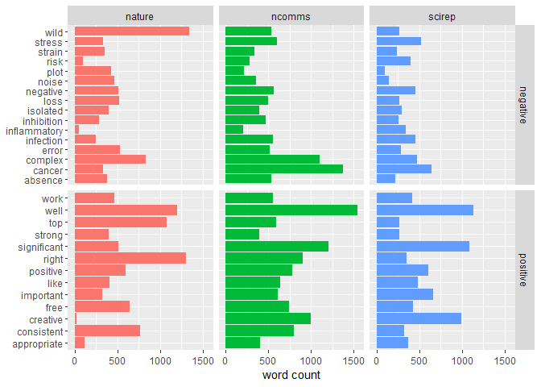
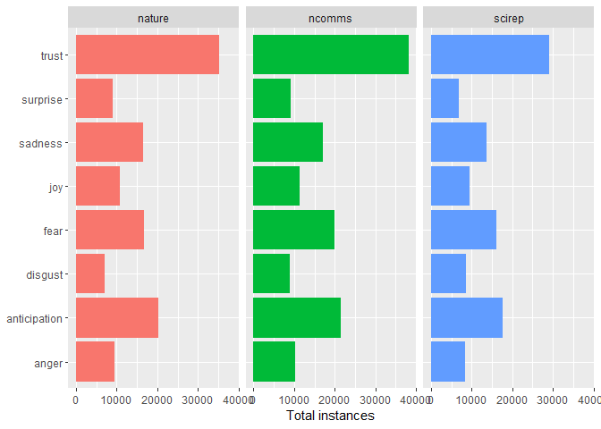

Can I publish this in Nature: Sentiment Analysis
================
2018-11-07

An interesting question is whether articles published in journals of varying prestige differ in the sentiments of their text. More generally, I'd say most scientists would call their writing neutral with respect to sentiment, but I'm curious if that actually pans out. The `tidytext` package makes this straigtforward, so let's dive in.

``` r
library(tidyverse)
library(tidytext)

nature.final <- read_csv("scraped_articles.csv", col_types = "ccc")
```

One thing to note is that there is no lexicon (at least that I'm aware of) specific to academic writing. So, we'll ues the general-purpose sentiment lexicons included in the `tidytext` package, and see how far we get. We'll start with the `bing` lexicon, which simply classifies words as 'positive' or 'negative'.

``` r
nature.bing <- nature.final %>%
  unnest_tokens(word, article) %>%
  inner_join(get_sentiments("bing"), by = "word")

nature.bing %>%
  group_by(journal) %>%
  summarise(freq.positive = mean(sentiment == "positive"))
```

    ## # A tibble: 3 x 2
    ##   journal freq.positive
    ##   <chr>           <dbl>
    ## 1 nature          0.520
    ## 2 ncomms          0.545
    ## 3 scirep          0.528

So, at least for the `bing` lexicon, it looks like this selection of articles do pretty well in maintaining a neutral tone. Let's break down the most frequently used positive and negative words used in each journal.

``` r
# wrangle top words by sentiment and journal - 
  # use this to filter entire dataset, otherwise facet plots will have missing values
top.words <- nature.bing %>%
  group_by(journal, sentiment) %>%
  count(word) %>%
  top_n(10, n) %>%
  ungroup() %>%
  select(sentiment, word) %>%
  distinct()
  
nature.bing %>%
  group_by(journal, sentiment) %>%
  count(word) %>%
  filter(word %in% top.words$word) %>%
  ggplot(aes(word, n, fill = journal)) +
  geom_col(show.legend = F) +
  labs(x = NULL, y = "word count") +
  facet_grid(sentiment ~ journal, scales = "free_y") +
  coord_flip()
```



Many of these words are to some extent misclassified within the lexicon, e.g. "plot" referring to a figure and not a conspiracy. However, it's likely a quagmire to actually clean all of those cases manually (as noted above, we'd like a science-specific lexicon, but I'm not about to construct one for this project). It's worth noting that there isn't a ton of variation among journals regarding sentiment - a set of 14 or 15 words is sufficient to include the top 10 most common words across journals for positive and negative sentiments, respectively. However, since this is for fun anyway, we can still poke around with what's there. As with the tf-idf analysis, we see that if you point out how 'creative' and 'significant' your analysis is, you're not going to make it to Nature; however, you should point out that you are in fact 'right' about whatever it is you're studying. On the negative side, if you can't actually study something using a wild-type variant, best to describe some other aspects of your results as 'wild' just to be safe. SciRep articles could maybe get a boost if they talk up how 'complex' their research is - perhaps that could be worked in instead of discussing 'risk' as much.

The `nrc` lexicon assigns more specific emotions to words, let's see if there's difference in more nuanced sentiment classification between the journals.

``` r
nature.nrc <- nature.final %>%
  unnest_tokens(word, article) %>%
  inner_join(get_sentiments("nrc"), by = "word") %>%
  filter(!sentiment %in% c("positive","negative"))

nature.nrc %>%
  group_by(journal, sentiment) %>%
  count(word) %>%
  summarise(total = sum(n)) %>%
  ggplot(aes(sentiment, total, fill = journal)) +
  geom_col(show.legend = F) +
  labs(x = NULL, y = "Total instances") +
  facet_wrap(~journal, nrow = 1) +
  coord_flip()
```



Interestingly, the breakdown is almost identical between journals; I'm going to guess that the words used in each sentiment category are almost the same across all of the articles. However, it's odd that SciRep articles seem the least concerned with conveying trust, since Nature papers are the ones that get retracted all the time. We can look at some of the words that are unique within sentiment categories by each journal as well, but the sentiment misclassification at this level is so severe that it's not really worth the discussion.

``` r
nature.nrc %>%
  group_by(journal, sentiment) %>%
  count(word) %>%
  top_n(10) %>%
  group_by(sentiment) %>%
  summarise(unique.words = length(unique(word)))

# There are more unique words than I thought, let's look at which words are unique to each journal in each sentiment category.

nature.nrc %>%
  group_by(journal, sentiment) %>%
  count(word) %>%
  top_n(10) %>%
  spread(journal, n) %>%
  filter(is.finite(nature) + is.finite(ncomms) + is.finite(scirep) == 1) %>%
  gather(journal, value, nature, ncomms, scirep) %>%
  na.omit() %>%
  select(-value) %>%
  arrange(sentiment, journal, word)
```

So, in concluision, sentiment analysis of academic articles is not particularly informative with generic sentiment lexicons. If you happen to know of a good science-specific one, let me know!
