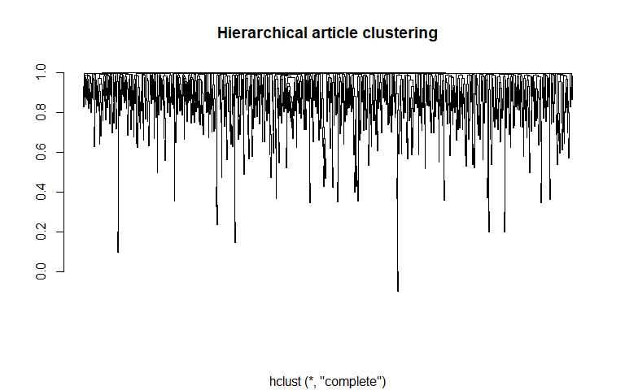

Can I publish this in Nature: Document Clustering and Topic Modelling
================
2018-11-09

Another question of interest is whether articles naturally cluster in a way that is informative towards what journal they're likely to end up in. Subject bias among the journals is an obvious candidate here (and from word frequency and tf-idf analyses we would expect a bias towards e.g. molecular cancer biology in Nature vs. organismal biology in SciRep), and clustering documents is one means of analyzing the prevalence of such a bias, by examining the key terms used by the algorithm to differentiate clusters to assign a subject and then counting how frequently articles from each journal appear in each cluster.

We can take a number of different approaches here. However, almost all of them rely on a document term matrix (DTM) as input, where each row is an article and each column a term (word, n-gram, etc.), with values the count of each word in a given document.

``` r
library(tidyverse)
```

    ## -- Attaching packages -------------------------------------------------------- tidyverse 1.2.1 --

    ## v ggplot2 3.0.0     v purrr   0.2.4
    ## v tibble  1.4.2     v dplyr   0.7.4
    ## v tidyr   0.8.0     v stringr 1.3.0
    ## v readr   1.1.1     v forcats 0.3.0

    ## Warning: package 'ggplot2' was built under R version 3.4.4

    ## -- Conflicts ----------------------------------------------------------- tidyverse_conflicts() --
    ## x dplyr::filter() masks stats::filter()
    ## x dplyr::lag()    masks stats::lag()

``` r
library(textmineR)
```

    ## Loading required package: Matrix

    ## 
    ## Attaching package: 'Matrix'

    ## The following object is masked from 'package:tidyr':
    ## 
    ##     expand

``` r
nature.final <- read_csv("scraped_articles.csv", col_types = "ccc")

# CreateDtm() doesn't like non-ascii characters with it's built-in cleaning functions, so we'll remove them
nature.clean <- nature.final %>%
  mutate(article = stringi::stri_trans_general(article, "latin-ascii"))
  
nature.dtm <- CreateDtm(doc_vec = nature.clean$article, 
                        doc_names = nature.clean$url,
                        stopword_vec = c(stopwords::stopwords("en"),
                                         stopwords::stopwords(source = "smart"),
                                         "extended", "data", "supplementary", "fig")) # filter out boring Nature signals
```

The max term length of 537 is a bit worrying, but I'm going to assume it's not particularly frequent and thus unlikely to affect downstream analyses. Onward!

We'll use Latent Dirichlet Allocation (LDA) for topic modelling. LDA will treat each document as a mixture of topics (the number of which we supply a priori, not unlike k-means), and each topic as a mixture of words, with words assigned probabilistically to each topic. However, I have no idea what a good k is for this analysis, so lets poke around with more basic clustering methods using the tf-idf and cosine similarity to see what a good starting point might be.

``` r
# get a DTM-friendly version of idf
tf.stats <- TermDocFreq(nature.dtm)

# calculate tf-idf matrix by multiplying tf (in DTM) by idf
tf.idf <- t(t(nature.dtm[, tf.stats$term]) * tf.stats$idf)

# calculate cosine similarity (dot product of positive unit vectors)
csim <- tf.idf / sqrt(rowSums(tf.idf * tf.idf))
csim <- csim %*% t(csim)

# hierarchical clustering
cdist <- as.dist(1 - csim)
hc <- hclust(cdist)

plot(hc, labels = F, main = "Hierarchical article clustering", xlab = "", ylab = "")
```



While this plot isn't particularly useful in identifying clusters, it does show some curious patterns in the data. In particular, the handful of what appear to be article pairs at the ends of extrememly long branches - perhaps these are articles that are on the exact same subject? It might be of interest to pull a few of these out and look at them in more detail, but for now we'll leave that for a future exploration.

Let's instead zoom in to the deeper branches of the tree to identify a reasonable number of clusters to move forward with.

``` r
plot(as.dendrogram(hc), leaflab = "none", main = "Hierarchical article clustering", xlab = "", ylab = "",
     ylim = c(0.998, 1))
rect.hclust(hc, 8, border = "red")
```


It seems like somewhere in the neighborhood of 10 clusters is a good place to start (I've highlighted a cutoff of eight clusters here, which I'll use moving forward). Note that this clustering is based solely on similarity of term frequencies within the collection of articles, and is therefore only intended as a jumping-off point for the LDA model. However, this approach could be useful if e.g. we wanted to identify keywords that would relate similar articles to each other.

Now, onto the LDA model.

``` r
library(topicmodels)
```

    ## Warning: package 'topicmodels' was built under R version 3.4.4

``` r
library(tidytext)
```

    ## Warning: package 'tidytext' was built under R version 3.4.4

``` r
# fit LDA model, this will take a few minutes...
nature.lda <- LDA(nature.dtm, k = 8, control = list(seed = 666)) # always use most metal algorithm seed \m/ 

# construct tidy dataframe, relating words and associated posterior probabilities (beta) to topics
(nature.topics <- tidy(nature.lda, matrix = "beta"))
```

    ## # A tibble: 512,448 x 3
    ##    topic term        beta
    ##    <int> <chr>      <dbl>
    ##  1     1 infact 2.33e-257
    ##  2     2 infact 7.03e-270
    ##  3     3 infact 9.65e-260
    ##  4     4 infact 1.70e- 44
    ##  5     5 infact 5.92e-185
    ##  6     6 infact 3.39e-  6
    ##  7     7 infact 5.75e-269
    ##  8     8 infact 4.28e-270
    ##  9     1 aclac  5.26e-204
    ## 10     2 aclac  1.58e-269
    ## # ... with 512,438 more rows

Right! So, "infact" (in fact...?) is most highly associated with topic number 6, but even then not very strongly based on the posterior probabilities - this makes sense, since it's not a real word and I'm not sure where it came from. However, the LDA algorithm probably found other real words that signal different topics, so let's visualize those with the strongest associations to see if we can't infer to which subjects (or whatever else) each topic cluster is related.

``` r
nature.topics %>%
  group_by(topic) %>%
  top_n(10, beta) %>%
  ungroup() %>%
  arrange(topic, -beta) %>%
  mutate(term = reorder(term, beta)) %>%
  ggplot(aes(term, beta, fill = factor(topic))) + 
  geom_col(show.legend = F) +
  facet_wrap(~topic, nrow = 2, scales = "free") + 
  coord_flip()
```


Recall that LDA allows for overlap among both terms and topics among documents - hence why we see topics 2 and 8 are both strongly associated with "cells" and "expression", but topic 8 is associated with "mice" and topic 2 isn't. For these 8 clusters, the bias towards biology is apparent, with 6 of the 8 clusters representing various subfields in biology, and the remaining two devoted to physical sciences. Based on these results, I might (loosely) assign the following labels to each cluster:

Now that we have some idea about what each topic represents, let's look at how topics are assigned to articles, and how they're distributed among journals. Gamma values in the LDA model indicate the proportion of words within a document that are associated with the indicated topic; below, we see the first document (a NatComms article) is most closely associated with topic 7 (physics):

``` r
nature.docs <- tidy(nature.lda, matrix = "gamma") %>%
  left_join(select(nature.final, -article), by = c("document" = "url")) %>% # add journal info 
  arrange(document, topic, -gamma)

nature.docs[1:8,]
```

    ## # A tibble: 8 x 4
    ##   document                                          topic    gamma journal
    ##   <chr>                                             <int>    <dbl> <chr>  
    ## 1 https://www.nature.com/articles/s41467-018-06039~     1  1.08e-5 ncomms 
    ## 2 https://www.nature.com/articles/s41467-018-06039~     2  1.08e-5 ncomms 
    ## 3 https://www.nature.com/articles/s41467-018-06039~     3  1.08e-5 ncomms 
    ## 4 https://www.nature.com/articles/s41467-018-06039~     4  1.08e-5 ncomms 
    ## 5 https://www.nature.com/articles/s41467-018-06039~     5  1.08e-5 ncomms 
    ## 6 https://www.nature.com/articles/s41467-018-06039~     6  1.08e-5 ncomms 
    ## 7 https://www.nature.com/articles/s41467-018-06039~     7 10.00e-1 ncomms 
    ## 8 https://www.nature.com/articles/s41467-018-06039~     8  1.08e-5 ncomms

Using gamma, we can assign a topic to each article, and visualize how topics are distributed among journals. Note that in many cases articles might be credibly assigned to multiple topics (interdisciplinary work and all that), but in this instance we'll make the simplifying assumption of one topic per article.

``` r
nature.docs %>%
  group_by(document, journal) %>%
  top_n(1, gamma) %>%
  group_by(journal) %>%
  count(topic) %>%
  ungroup() %>%
  mutate(topic = fct_recode(as.factor(topic), 
                            chemistry = "1",
                            cell_biology = "2",
                            ecology = "3",
                            climate_science = "4",
                            protein_biology = "5",
                            medical_studies = "6",
                            physics = "7",
                            poor_mice = "8")) %>%
  ggplot(aes(journal, n, fill = topic)) +
  geom_bar(stat = "identity") +
  scale_fill_viridis_d() +
  labs(x = NULL, y = "topic counts")
```


So, there are some differences in subject representations among the journals, but they aren't huge. Suprisingly, medical articles (ones associated with the word "patients") are underrepresented in Nature; it may be the case that since those studies are rarely as mechanistic as some of the other bio fields, they have to be *really* flashy to make it to Nature, where if history is any indication they will eventually be retracted and/or found to be irreproducible. NatComms doesn't seem to like ecology papers, and I suspect that this is due to the existence of several ecology-specific journals that are better regarded than NatComms (like Ecology Letters) that authors would prefer if they get bounced from Nature. Mice are doomed across all levels of the hierarchy. Though it's a very small sample, it's also interesting that the categories trend towards greater evenness with decreasing impact factor; I would expect this given that A) flashy results are not evenly distributed among fields, and B) the sheer volume of articles increases (since they aren't being subjected to artificial scarcity nonsense) in lower impact journals, such that articles aren't likely to be bounced just because their subject isn't the current vogue.
